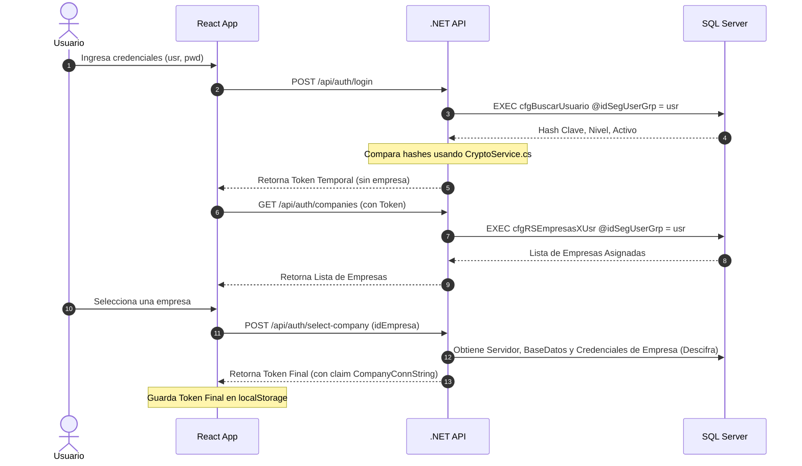

# Arquitectura del Sistema - SADE Security

Este documento describe la arquitectura técnica de la versión web del módulo de Seguridad y Conexión de SADE ERP.

---

## 1. Patrón Arquitectónico General

El sistema sigue un modelo desacoplado cliente-servidor, diseñado para ser altamente escalable, seguro y reutilizable como la base del ecosistema web de SADE ERP:

```
┌─────────────────────────────────────────┐
│           Frontend (React Web)          │
└────────────────────┬────────────────────┘
                     │ (REST / JSON)
                     ▼
┌─────────────────────────────────────────┐
│        API Gateway (.NET 8 Web API)     │
└────────┬────────────────────────┬───────┘
         │                        │
         │ (Conexión Fija)        │ (Conexión Dinámica)
         ▼                        ▼
┌─────────────────┐      ┌─────────────────┐
│ DB Global       │      │ DB Empresa      │
│ (CBSRepository) │      │ (Financiera)    │
└─────────────────┘      └─────────────────┘
```

### 1.1 Conexión Dinámica Multitenant (Bases de Datos Híbridas)
La arquitectura implementa un enrutamiento de base de datos **estateless y dinámico** en el backend:
1.  **Conexión Central**: El backend mantiene una conexión estática a `CBSRepository` para resolver la autenticación del usuario, auditoría global y listado de empresas asignadas.
2.  **Conexión de Empresa Transaccional**: El backend no guarda cadenas de conexión locales de las empresas. En su lugar, cuando el usuario selecciona una empresa, el backend recupera y desencripta sus credenciales desde `CBSRepository..cfgEmpresa` y genera un token JWT especial que encapsula de forma firmada la cadena de conexión final de la empresa.
3.  **Ejecución Stateless**: En cada llamada subsecuente a la API (CRUD de usuarios locales, permisos, transacciones), el middleware/controlador lee la conexión correspondiente desde los claims del token JWT, abre una conexión en caliente a la base de datos de la empresa (ej. `Financiera`) y ejecuta la lógica directamente en SQL Server.

---

## 2. Tecnologías Utilizadas

### 2.1 Backend (.NET 8 ASP.NET Core)
*   **Lenguaje**: C# 12.
*   **Driver BD**: `Microsoft.Data.SqlClient` (para llamadas directas y óptimas a Stored Procedures sin sobrecarga de ORMs pesados).
*   **Seguridad**: `Microsoft.AspNetCore.Authentication.JwtBearer` para firmar y validar tokens JWT.
*   **CORS**: Habilitado globalmente para el frontend en desarrollo.

### 2.2 Frontend (React + Vite + TypeScript)
*   **Scaffolding**: Vite (compilación ultra rápida de assets).
*   **Tipado**: TypeScript (para asegurar la integridad de datos).
*   **Navegación**: `react-router-dom` para el manejo de rutas protegidas y guards de seguridad.
*   **Llamadas HTTP**: Axios (con interceptores para adjuntar tokens JWT y manejar redirecciones ante expiración/desconexión).
*   **Iconografía**: `lucide-react`.

---

## 3. Flujo de Autenticación y Autorización (JWT)



### Control de Accesos mediante Filtro de Acción (`SadeAuthorizeAttribute`)
En lugar de escribir lógica de permisos en C#, el backend utiliza un filtro de acción de ASP.NET Core (`SadeAuthorizeAttribute`) en sus endpoints:
*   El atributo toma el nombre técnico de la pantalla y la acción (ej. `[SadeAuthorize(ObjectName = "FormFactura", Permission = SadePermission.Editar)]`).
*   Al recibir el request, el filtro intercepta la llamada, extrae la conexión del JWT, y ejecuta el Stored Procedure `Permisos` en la base de datos de la empresa.
*   Si la base de datos retorna nivel `0` (Denegado), detiene el request con `403 Forbidden`.
*   Si requiere clearance superior al del usuario, retorna un JSON estructurado indicando que se requiere override de supervisor.

---

## 4. Estructura y Sistema de Temas del Frontend

El frontend cuenta con un diseño profesional responsivo en modo oscuro nativo, implementando una sidebar colapsable y componentes de tabla/tarjetas reutilizables.

### Sistema de Temas (index.css)
Los estilos se basan en variables CSS declaradas en `:root`. Para soportar un tema claro en el futuro, solo se requiere inyectar la clase `.light` en el elemento `<html>`, modificando dinámicamente las variables a sus correspondientes valores claros sin tocar una sola línea de código JavaScript:

```css
:root {
  --bg-primary: #080C14;
  --bg-secondary: #0F1626;
  --border: #1E293B;
  --text-primary: #F3F4F6;
  /* ... */
}

:root.light {
  --bg-primary: #F9FAFB;
  --bg-secondary: #FFFFFF;
  --border: #E5E7EB;
  --text-primary: #111827;
  /* ... */
}
```

---

## 5. Escalabilidad para Nuevos Módulos

Esta aplicación sirve como la **Plantilla Base** para la migración de los siguientes módulos del ERP SADE (Inventario, Compras, etc.):
1.  **Frontend Reutilizable**: Toda pantalla nueva hereda el layout general con el `<Sidebar />` dinámico. El `AuthContext` expone de forma global la información del usuario y los permisos que pueden ser validados en los componentes utilizando hooks simples.
2.  **Backend Reutilizable**: Cualquier nuevo endpoint de negocio puede ser protegido agregando el filtro `[SadeAuthorize]`, garantizando control centralizado de accesos desde el primer día.
